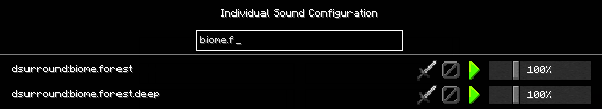

.. role:: sectiontitle

Individual Sound Configuration
==============================

The **Individual Sound Configuration** screen allows the player to customize special handling of a sound when it is played. This screen is accessible in game via keybind (if setup), or
by clicking on the *Configure Sounds* button in the bottom left corner of the *Music & Sounds* options dialog:

|

The **Individual Sound Configuration** screen will list *all* sounds that have been detected in the ``sounds.json`` file for all loaded mods and resource packs, regardless if they have been registered with Minecraft.

|

If the resource location ID of the sound is known, it can be entered into the search box. All sounds matching the criteria will be listed.  Referencing the image above, the list was filtered to those sounds that
have ``biome.f`` in the ID. To filter by mod ID, enter in the mod ID (ex, ``dsurround``), or even if the name is not specifically known text can be entered in an attempt to locate (ex, ``zombie``).

.. list-table:: Iconagraphy
    :widths: auto
    :align: center
    :header-rows: 1

    *   - Icon
        - Name
        - Description
    *   - |cull_on| |cull_off|
        - Cull
        - Enable/disable culling when playing the sound. Default is disabled culling.
    *   - |block_on| |block_off|
        - Block
        - Enable/disable blocking of the sound. Default is disabled blocking.
    *   - |play| |stop|
        - Play
        - Plays the sound to help with identification
    *   - |volume|
        - Volume Scaling
        - Scaling factor to apply to the volume when playing the sound. Value can be between 0 and 400. 0 effectively blocks the sound, and 400 will scale the volume 4 times.

The data for the sound configuration will be stored in the ``soundconfig.json`` file in Dynamic Surrounding's config folder. See :doc:`modconfiguration` for more information.

:sectiontitle:`Sound Culling`

Sound culling can be a bit challenging to wrap your mind around. Best way to understand is with an illustration. Let's say you have an animal farm, with a pen holding 50 cows. Normally, each cow could have
an ambient sound effect generated. This creates a noisy environment, and increases the load on the sound engine. To reduce the noise, the ambient sound that a cow makes can be marked for culling.

What Dynamic Surroundings will do is keep track of the when the cow ambient sound is played. If another play of that sound occurs within 1 second (the default interval), it will block those plays. Result is that
only a single cow ambient sound will be played per second. So in our example of 50 cows, instead of getting upwards of 50 sounds played, only a single instance will be permitted.

:sectiontitle:`Sound Blocking`

Blocking a sound will instruct Dynamic Surroundings to prevent any sound effect using that sound. This is useful for blocking sounds that are disliked, or for some reason a mod continually generates overloading
the sound engine. Only sounds that are played through the Minecraft sound engine can be blocked.

.. note::

    Dynamic Surroundings sounds can be blocked as well, so if you don't like a sound in the mod, block it.

:sectiontitle:`Volume Scaling`

This setting will allow the volume of a sound to be increased (value greater than 100), or decreased (value less than 100). Keep in mind this is *scaling*, it's not the actual volume at which the sound is played.

Not all sounds can be affected by volume scaling. For example, Minecraft thunder plays at a very high volume (12,000 IIRC), and applying a 1% scaling will reduce it down to 120. A sound normally plays in the volume
range of 0.0 - 1.0.

.. |cull_on| image:: images/cull_on.png
    :alt: Cull On

