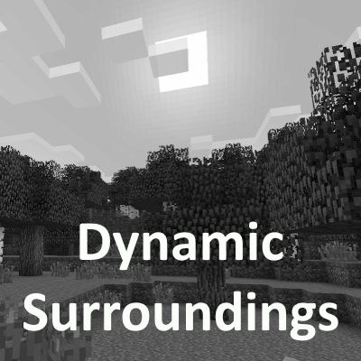

Welcome to Dynamic Surroundings!
================================

Dynamic Surroundings is a Minecraft 1.21.1 mod that alters the fabric of Minecraft experience by weaving a tapestry of sound and visual effects. It is available for Fabric and NeoForge.

Dynamic Surroundings is 100% client side, meaning that it can easily be added to any mod pack without requiring an update to a server. Furthermore,
it can be used with minimal Fabric or NeoForge clients when connecting and playing on Vanilla servers.

.. raw:: html

   

      
      
      
   

.. note::
   This documentation is under development

.. toctree::
   :hidden:

   installation
   config/configuration
   videos
   scripting/scripting
   scripting/examples
