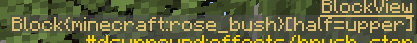

.. role:: sectiontitle

Block Specifications
====================

Block specifications are matchers utilized in various parts of the configuration. There are 3 forms of matchers: Direct, Tag, and BlockState match.

:sectiontitle:`Direct`

Explicit using the resource location ID of the block (ex, ``minecraft:cobblestone``). This will match all variations of the block.

:sectiontitle:`Tag`

This matcher matches based on the presence of a block tag (ex, ``#minecraft:wood``). The ``#`` prefix tells the config parser that it should be interpreted as a tag. The tag can be from any mod.

:sectiontitle:`BlockState`

This is an enhanced version of Direct. Additional block state properties can be specified to filter down to a specific set of variants. For example, if the sound or effect only applies to fully
grown Nether Wart it can be expressed as ``minecraft:nether_wart[age=3]``. Multiple properties between the ``[]`` are comma separated.

Further examples:

.. list-table::
    :widths: auto
    :align: center
    :header-rows: 1

    *   - Matcher
        - Comment
    *   - ``minecraft:redstone_wire[power=15]``
        - Matches a redstone wire wire that is full powered regardless of connections.
    *   - ``minecraft:redstone_torch[lit=true]``
        - Matches a redstone torch that is lit; unlit ones will not match

You can get information about a block while in game by using Minecraft's debug display (F3) or you can use the Dynamic Surroundings debug overlay (key needs to be mapped). When looking at a block it will
list information about that block, including any variant parameters. Here is an example from the Dynamic Surroundings debug overlay:

|

This shows the upper half of a rose bush.  The block is ``minecraft:rose_bush`` with the variant ``half=upper``. The lower portion would be the variant ``half=lower``. The three possible matchers for
the block state can be:

.. list-table::
    :widths: auto
    :align: center
    :header-rows: 1

    *   - Matcher
        - Comment
    *   - ``minecraft:rose_bush``
        - Matches any block state that uses the block ``mineraft:rose_bush``. In this case, it would match both variants.
    *   - ``minecraft:rose_bush[half=upper]``
        - Matches the upper half of a rose bush.
    *   - ``minecraft:rose_bush[half=lower]``
        - matches the lower half of a rose bush.
