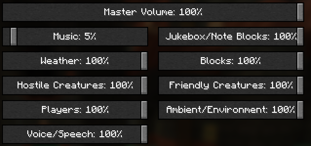

.. role:: underlined

sound_factories.json
====================

`Source reference <https://github.com/OreCruncher/DynamicSurroundingsFabric/blob/main/common/src/main/resources/assets/dsurround/dsconfigs/sound_factories.json>`_

Sound factories are the heart of most sound effects generated by Dynamic Surroundings. A factory combines a sound event with information that describe the properties of that sound
when played. For example, a factory could generate a sound using the same sound event, but with varying pitch and volume.

The schema for a sound factory entry is as follows:

.. code-block:: JSON

    {
        "location": "namespace:path",
        "soundEvent": "namespace:path",
        "volume": 1.0,
        "pitch": 1.0,
        "category": "AMBIENT",
        "isRepeatable": false,
        "repeatDelay": 0,
        "global": false,
        "attenuation": "LINEAR",
        "music": {
            "min_delay": 6000,
            "max_delay": 24000,
            "replace_current_music": false
        }
    }

* :underlined:`location` - The resource location ID of the sound factory. It should be unique across configurations. It is a required property. Most configuration rules refer to a factory by this ID.
* :underlined:`soundEvent` - The sound event that the factory will produce. It is a required property.
* :underlined:`volume` - The volume scale to apply to the sound when playing. The value can either be a float, or a range with min/max. Default is 1.0F.
* :underlined:`pitch` - This pitch at which to play the sound. The value can either be a float, or a range with min/max. Default is 1.0F.
* :underlined:`category` - The category to which the sound will belong when played. Default is ``AMBIENT``.
* :underlined:`isRepeatable` - Whether the sound should be marked as repeatable (looped) when played. Default is ``false``.
* :underlined:`repeatDelay` - The tick delay between plays for a repeatable sound. Default is 0.
* :underlined:`global` - Whether the sound is considered global or not. Default is ``false``.
* :underlined:`attenuation` - Attenuation of the sound. Default is ``LINEAR``.
* :underlined:`music` - Properties to apply when the music manager plays the sound as music. This property is optional.
* :underlined:`music.min_delay` - TBD
* :underlined:`music.max_delay` - TBD
* :underlined:`music.replace_current_music` - TBD

``category`` can be one of the following: MASTER, MUSIC, RECORDS, WEATHER, BLOCKS, HOSTILE, NEUTRAL, PLAYERS, AMBIENT, and VOICE. The ``category`` property matches a sound source in the sound options
dialog, and will be scaled by the amount specified by the sound source.

``attenuation`` is either LINEAR or NONE. Most sounds are LINEAR, meaning the volume is linearly scaled based upon the distance from the player. Most sounds in Minecraft are LINEAR. NONE are for
sounds that do not concern themselves with distance. Such sounds are things like music, button clicks, and background sound tracks.

``volume`` and ``pitch`` are special in that they can either have a single float value, or have a range. If a range is specified, when a sound instance is created a random value
is selected from the range. By varying volume and pitch in this fashion complex sounds can be layered to give an overall sound impression. For example, waterfall splash sounds
have varying pitch. If the pitch were not varied, an artificial harmonic would be introduced which is not enjoyable.

The range is specified like the following:

.. code-block:: JSON

    "volume": {
        "min": 0.8,
        "max": 1.2
    }

When a sound instance is created, the volume will be between 0.8 and 1.2 inclusive.