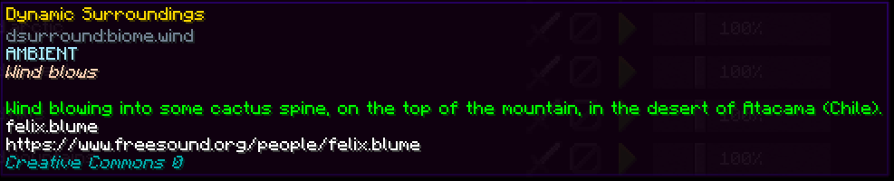

sounds.json
===========

Dynamic Surroundings extends Minecraft sound definitions with additional fields. These fields are used to render atribution and license information
in the **Individual Sound Configuration** configuration menu.

This is an example from Dynamic Surroundings ``sounds.json`` file:

.. code-block:: JSON

	"biome.wind": {
		"subtitle": "dsurround.sound.caption.wind",
		"ds_credits": [
			{
				"name": "Wind blowing into some cactus spine, on the top of the mountain, in the desert of Atacama (Chile).",
				"author": "felix.blume",
				"website": "https://www.freesound.org/people/felix.blume",
				"license": "Creative Commons 0"
			}
		],
		"sounds": [
			{
				"name": "dsurround:ambient/outside/wind",
				"stream": true
			}
		]
	}

The extended information can be found in the ``ds_credits`` property. The property is an array of entries where each entry could correspond to an individual ogg file
that make up the sound event. This is what it looks like when rendered in the Minecraft client:

*Any* ``sounds.json`` file can be augmented with the ``ds_credits`` property data. Dynamic Surroundings will scan all mods and resource packs looking for this augmented
information so that it can be rendered in the display. Minecraft will ignore this property information.

Sounds defined in ``sounds.json`` do not have to be registered as sound events with Minecraft. Dynamic Surroundings will read the content of the file and initialize it's
own internal caches. This allows resource pack authors to add new sounds to the client (rather than replace) without the need of support code.